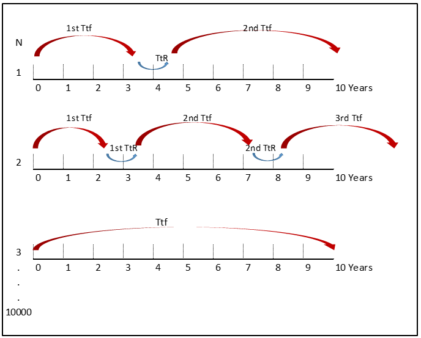

MTBF as a Measure of Risk
================

## What MTBF is and what is not

MTBF is one of the reliability metrics that is oftenly toss around. It
is popular because ‘mean time between failure’ is handy. But it can be
misleading. It doesn’t mean what some people think it means. Some
consider it as lifetime of a product, which is not. Other use it to plan
their regular maintenance, i.e MTBF of 2 years as a basis for regular
maintenance every 2 years. Which is not a correct approach. In short
MTBF is not a failure free period, this is where people sometimes are
mislead.

MTBF is statistical resume of population of certain component, it is
more suitable to treat MTBF as measure of risk and it is too risky to
use only the MTBF to predict specific time to failure of one particular
component. Strictly speaking, MTBF terms is applicable for components
where their failure rates are characterized by exponential distribution
(constant failure rate represented by flat bottom of bathtub curve), in
this case MTBF is equal to inverse of failure rate.

## How to use MTBF

What MTBF actually means? For example what 5 years MTBF means? The key
to this question is *reliability* and we also need to ask another
question in order to have a proper answer, which is how long is the
mission time? how long we plan to put that particular component in
operation? Let us assume 5 year of mission time
() for a component with
5 years MTBF of constant failure rate. Given that reliability for
constant failure is }"), for this case we will have reliability
of 36.78%.it means in five years this component will only have 36%
chance to run without failure. If instead we have 100 items of this
component, we will have approximately 36 items who are still functioning
while the other 64 will fail before five years. This is the proper way
of treating MTBF information, you need both the MTBF and mission time.

## MTBF, Reliability and Monte Carlo Simulation

Having reliability helping us answering MTBF problem like in previous
example, the next question is what should we do with reliability of 36%?
or if we have lower reliability since we have longer mission time? We
can switch to other component with better MTBF value in order to have
higher reliabiity / probability of success until we reach the acceptable
level, or we can accept the risk of failure and repair or replace the
component when failure occurs. For either approach, Monte Carlo
simulation is very useful in helping us answering more questions related
to this, like how often we expect the failure to occur, how long is the
downtime, how high is the availability? With this information we have
better risk understanding of certain MTBF value. That is the purpose of
this simulation.

## What is Monte Carlo Simulation

Monte Carlo Simulation (MCS) uses pseudo random numbers generator and
statistical models to simulate (imitate) reality. In the case of
availability simulation, this approach is similar to a virtual
experiment in which a random number is generated based on the failure
rate characteristic of the evaluated component in order to represent its
time to failure. The resulting time to failure from the simulation is
then evaluated against the required mission time, where their failure
occurrences and required reparation are recorded. The process is
repeated for large number of times, each one behaving differently due to
the stochastic characters of the component failure behavior. From the
accumulative output, the mean availability and other information can be
gathered. The accuracy of the simulation is depends on the accuracy of
the probability distribution of the component failure and the numbers of
repeated simulaton.

In MCS, the inverse transform method is one of the technique to generate
random numbers from any failure rate distribution type given its
cumulative distribution function (CDF). CDF is the unreliability
function of a component. Inverse transform method takes uniform samples
of a number  between 0
to 1, interpreted it as a unreliability and then inverting that function
to have the time to failure of the component. For component failure rate
with exponential distribution type, the CDF and its inverse transform
method is expressed as:   
 = 1 - e^{(-\\lambda .TtF)}")  
where   
")  

. Illustration of inverse transform method to generate simulated time to
failure for component with exponential distribution failure rate

 

The following figure illustrates the MCS procedure. For the first
simulation, the component fails after 3 years of operation (1st TtF),
then it undergoes a corrective maintenance.

  In this illustration the total mission duration is 10 years. After
the restart, a new random number is generated to simulate the time to
failure of the component. The process is repeated until the accumulated
time surpass the mission time which is 10 years. For the first
simulation the component total time (TT) surpass the mission duration
with one failure. On the second simulation, through similar random
number generation process, the component fails twice throughout its
mission duration, whereas the third simulation the component does not
fail at all. For each iterations, the following informations are
recorded: - Reliability and availability - Total number of repairs -
Which components causing the failure and their time to failure

This procedure is then repeated for
 times. In the end, the
component availability is estimated to be the mean availability value of
the  simulation. The
other parameters are also averaged from the
 simulation.

## More about this simulation

This simulation is developed in R programming language. It is hosted in
[shinyapps.io](https://manunk.shinyapps.io/monte-carlo-simulation-of-mtbf/).
Due to limitation of this account, several simulation parameters are
constrained to certain values.

| Items                       | Remarks                                                                                                                                                                                                 |
| --------------------------- | ------------------------------------------------------------------------------------------------------------------------------------------------------------------------------------------------------- |
| MTBF                        | Mean Time Between Failure in year (Max = 10)                                                                                                                                                            |
| time\_to\_repair            | Time to repair the component in hours.                                                                                                                                                                  |
| Mission Time Duration       | Duration of the system (in year) to which the time to failure of the component is evaluated against. (Max = 10 years)                                                                                   |
| Simulations Number          | Number of simulation iterations to be conducted (Max = 5000)                                                                                                                                            |
| Reliability from equation   | Deterministic reliability from equation }") |
| Reliability from simulation | Estimated reliability from monte carlo simulation                                                                                                                                                       |
